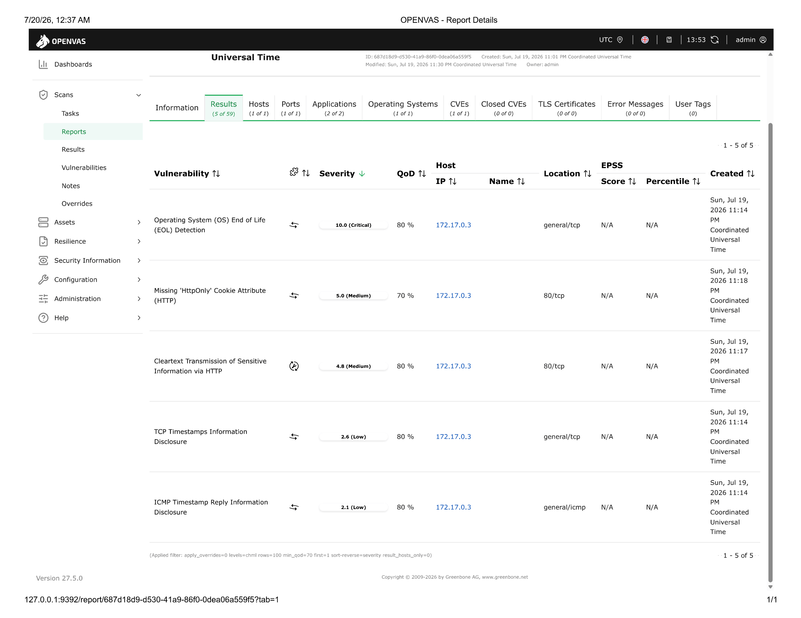
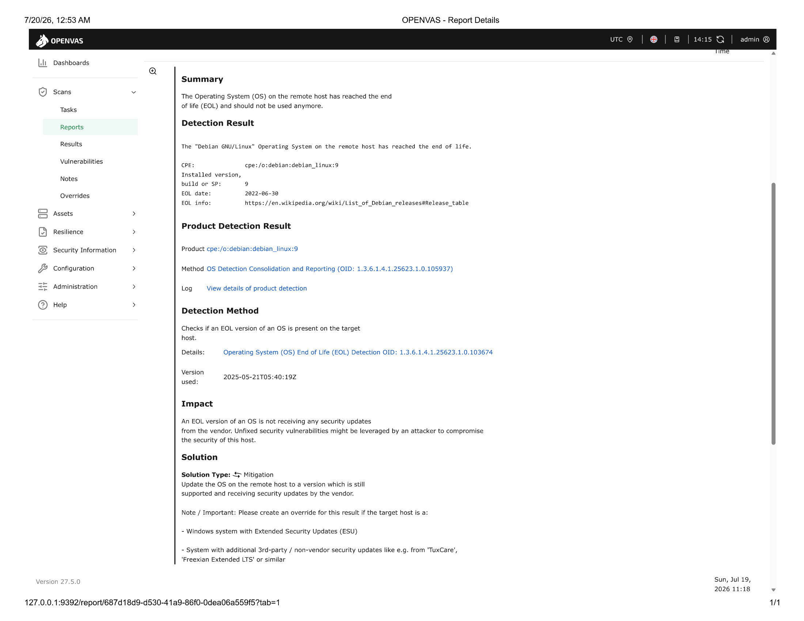

\# Vulnerability Assessment

\*\*Vulnerability scan and remediation report against an intentionally vulnerable web application, using OpenVAS/GVM.\*\*

\## Background

DVWA (Damn Vulnerable Web Application) is a purpose-built, intentionally vulnerable PHP/MySQL web application used for security training and tool practice. This project scans a DVWA instance with OpenVAS (Greenbone Vulnerability Manager) to identify, categorize, and recommend remediation for real, detectable vulnerabilities — replicating the workflow of a vulnerability assessment on a live system.

\## Objective

Run a vulnerability scan against a target host, interpret the findings by severity, and produce a remediation report suitable for handoff to a system owner.

\## Target

DVWA (Damn Vulnerable Web Application), running in a Docker container (`vulnerables/web-dvwa`) on the internal Docker network at `172.17.0.3`. Used intentionally as a safe, legal, purpose-built vulnerable target — not a real production system.

\## Tools Used

\- OpenVAS / Greenbone Vulnerability Manager (GVM), self-hosted via Docker

\- Scan profile: "Full and fast"

\## Methodology

1\. Deployed GVM in a Docker container and DVWA in a separate container on the same Docker network

2\. Configured DVWA's internal container IP as a scan target in GVM

3\. Ran a "Full and fast" vulnerability scan against the target

4\. Reviewed all 5 findings, prioritized by CVSS severity

5\. Documented the detection method, impact, and vendor-recommended remediation for each

\## Findings

 and 

| # | Vulnerability | Severity (CVSS) | Detail | Remediation |

|---|---|---|---|---|

| 1 | OS End of Life (EOL) Detection | \*\*10.0 Critical\*\* | Host runs Debian GNU/Linux 9, which reached end-of-life on 2022-06-30 and no longer receives vendor security updates | Upgrade the OS to a currently supported Debian release; any future vulnerabilities in an EOL OS will never be patched |

| 2 | Missing 'HttpOnly' Cookie Attribute | \*\*5.0 Medium\*\* | Session cookies (`PHPSESSID`, `security`) are sent without the HttpOnly flag, allowing them to be read by JavaScript | Set the HttpOnly attribute on all session cookies to prevent client-side script access, reducing session hijacking risk if XSS is present elsewhere |

| 3 | Cleartext Transmission of Sensitive Information via HTTP | \*\*4.8 Medium\*\* | The login form (`/login.php`) submits a password field over unencrypted HTTP | Enforce HTTPS/TLS for the entire site and redirect all HTTP traffic before any sensitive input is collected |

| 4 | TCP Timestamps Information Disclosure | \*\*2.6 Low\*\* | Host responds to TCP timestamp requests (RFC1323/RFC7323), allowing uptime to be calculated | Disable TCP timestamps (`net.ipv4.tcp\_timestamps = 0` on Linux) if not operationally required |

| 5 | ICMP Timestamp Reply Information Disclosure | \*\*2.1 Low\*\* | Host responds to ICMP timestamp requests, leaking system clock information | Disable ICMP timestamp replies at the host firewall level |

\## Prioritized Remediation Plan

1\. \*\*Immediate:\*\* Upgrade the EOL Debian 9 OS — this is the foundational risk; every other vulnerability class on an EOL system is effectively unpatchable long-term

2\. \*\*Short-term:\*\* Enforce HTTPS across the application and set HttpOnly on all session cookies — both directly protect user credentials and sessions

3\. \*\*Low priority / hardening:\*\* Disable TCP/ICMP timestamp responses to reduce host fingerprinting surface

\## Key Takeaway

This exercise demonstrates the ability to run a vulnerability scan against a live target, interpret CVSS-rated findings with their underlying technical cause, and produce a prioritized, actionable remediation plan — core deliverables of a vulnerability assessment in a real security analyst role.

\## Note

Scan performed against DVWA (Damn Vulnerable Web Application), an intentionally vulnerable application designed for security training, run in an isolated local Docker environment. No real production systems were scanned.

